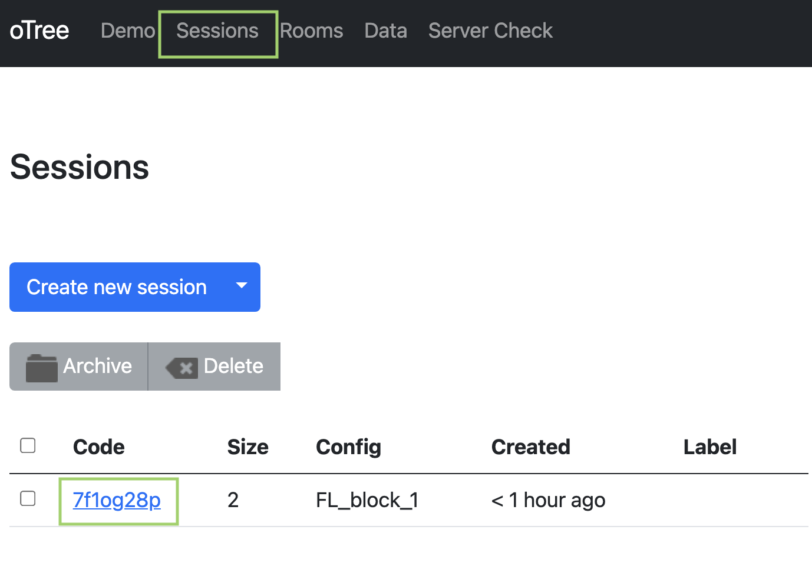
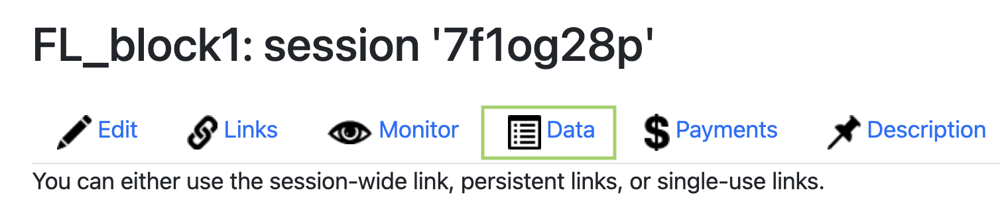
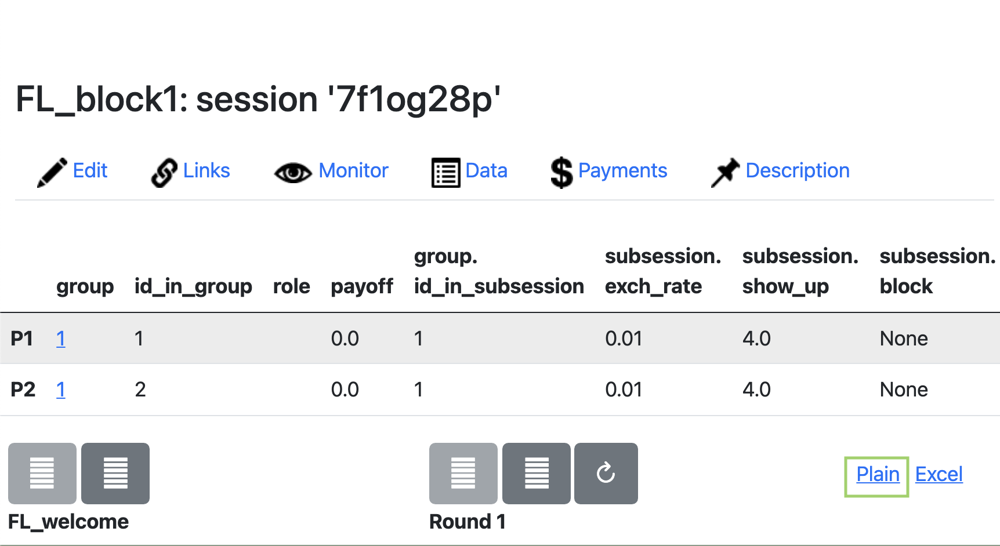

# Management of Lab Experiments in oTree
### FoodLand Project

## Description

As reported in the  opening of the project website (otree.org) “oTree is an open-source platform for web-based interactive tasks”. Otree is free (https://opensource.org/licenses/MIT) and can be downloaded from https://otree.readthedocs.io/en/latest/install.html
It is rapidly becoming the reference platform for experiments in economics, both online and in the lab.
The reference languages for programming an oTree experiment are Python and HTML. 
Each experiment can be thought as a web app (for live demos, see https://otree-more-demos.herokuapp.com/demo).

## Server/client communication

Users can interact with an oTree app through an Internet browser in a client/server infrastructure. Typically, the app is located on a server where oTree and its dependencies are installed. When a session is opened on the server, links are generated and distributed to users that will connect to the server by inserting the link in their client’s browser. Potentially, any device with a browser can be a client and interact with the app.

## Implementation settings

Two main environments allow users to interact with the app: *laboratory* and *remote*.

### Laboratory

In a laboratory setting, users are generally present in a room with cubicles that warrant users’ privacy. Each user had access to a terminal. The server and the terminals are usually located under the same local network. Typically a lab is made of 1 Desktop PC that works as server and a number of terminals, usually Desktop PCs or Laptops, that are used Individually by participants. The number of terminals is generally between 20 and 30. When the client and server are not connected to the Internet it is important that they all inside a Local Area Network (LAN). 

To set up a LAN switches and cables are needed. Detailed instructions to configure one of your computers to be a server are provided in the [official documentation](https://otree.readthedocs.io/en/latest/server/adhoc.html).

Basically,

1) Find the IP address of the computer that works as server (usually something like *10.0.1.3*, or starting with *172* or *192*)
   
2) From this computer start the oTree server with command
   > otree prodserver YOURIPHERE:8000

3) Open a browser on your clients and follow the instructions below to *How to setup a session*. 

It is important that the IP address of your server does not change during the session!

### Remote server

In a remote setting, the app is located on a web server and it is accessed by clients via the Internet. Clients can be located anywhere, as long as they can connect to the server via the session link. An example of a remote setting is the one that relies on the cloud hosting provider Heroku (https://otree.readthedocs.io/en/latest/server/heroku.html). The remote setting requires a stable Internet connection to avoid problems in the client/server communication.

# How to setup a Room

In the settings.py file (see below) setup a room with 40 places

```python
ROOMS = [
 dict(
        name='econ_lab',
        display_name='Experimental Economics Lab 40s',
        participant_label_file='_rooms/labels.txt',
	    use_secure_urls=False
    )]
```

Each PC will then receive a specific URL with a PC identifier (PC1 ,PC2, PC2)

http://YOURIPHERE:8000/room/econ_lab?participant_label=PC1
http://YOURIPHERE:8000/room/econ_lab?participant_label=PC2
http://YOURIPHERE:8000/room/econ_lab?participant_label=PC3
http://YOURIPHERE:8000/room/econ_lab?participant_label=PC4
....

- From Computer 1 open the link http://YOURIPHERE:8000/room/econ_lab?participant_label=PC1

# How to setup a session

To setup a session

1) Start the otree server on your server machine with command 
> otree prodserver YUORIPHERE:8000

2) Open a broswer on your server machine and write

> http://YUORIPHERE:8000/sessions

Click the button <button type="button" class="btn btn-primary">Create new session</button>

3) Choose your app and the configuration settings from the interface that opens

4) When done, click the button <button type="button" class="btn btn-primary">Create</button>

This will create a series of links. Now the clients can connect to the server with these links. 

If you use Rooms (recommended), you follow a similar procedure but session is created directly from the Room

1) Ask your clients to connect to your room by writing the room address in their browser (sse above for instructions)
   
2) Open a broswer on your server machine and write

> http://YUORIPHERE:8000/rooms

3) Choose your room from the list
4) Choose your app and the configuration settings from the interface that opens
5) When done, click the button <button type="button" class="btn btn-primary">Create</button>

Now the session is active and clients connected to the room can start the session.

# Our apps

Two main experiments are developed, *block 1 and block 2*, that differ in the sequence of apps that are presented to participants


## Block 1
The following apps are contained in Block 1

1) *FL_welcome* 
    - This app must be the first in te sequence. It displays a welcoem messag eand general instructions.
    - It also loads pieces iof information about organizations from external .csv files. 

        **choices_inst.csv**

        Example: 

        | Institution | Choice_other_0 | Choice_other_30 | Choice_other_60 | Choice_other_90 |
        |-------------|----------------|-----------------|-----------------|-----------------|
        | A           | 0              | 15              | 80              | 120             |
        | B           | 0              | 20              | 40              | 100             |

                
                
                
        **institutions.csv**
        Example: 

        | Inst_Name | Inst_Type | Inst_Area | Inst_Product  |
        |-------------|----------------|-----------------|-----------------|-----------------|
        | A           | NGO              |Place X              | new nutrient-dense food product                  |
        | B           | Association              | Place Y              | new water irrigation saving technology           |

        - &#9888;  These files must be filled with the correct information about local organizations  and preserving the original structure
  
- *FL_DG* 
  - A Dictator Game: 2 phases, first with a peer then with the organization
    - Both choose as Dictators and know aftewards their actual role
- *FL_TG* 
  - A mini-investment game: 2 phases, first with a peer then with the organization
    - Play either as Recipient or as Sender
      - Both receive th eendowment
      - Strategy method  
- *FL_time*
  - A MPL estimation of time preferences
- *FL_risk*
  - A MPL estimation of risk preferences
6) *FL_payments*
   - Displays all payments and feedbacks


The order of FL_DG, FL_TG, FL_time, FL_risk can be randomized in *settings.py* (see below)

## Block 2

The following apps are contained in Block 2

1) *FL_welcome* 
    - This app must be the first in te sequence. It displays a welcome message and general instructions.

-FL_PGG
    - A 4-player PGG over 2 rounds in a partner fashion
      - Round 1: PGG
      - Task: subjects are either assigned to an *identity task* (to create group identity) or to an *individual task*
        - Controlled from *settings.py* (see below)
      - Round 2: PGG

- *FL_time*
  - A MPL estimation of time preferences
- *FL_risk*
  - A MPL estimation of risk preferences

6) *FL_payments*
   - Displays all payments and feedbacks

# settings.py

This file controls general settings of the experiment. It looks like this


```python

LANGUAGE_CODE = 'en' # <- CHANGE GERE: it,en

SESSION_CONFIG_DEFAULTS = {
    'real_world_currency_per_point': 0.00,
    'participation_fee': 0.00,
    'doc': ""
}
# e.g. EUR, GBP, CNY, JPY
REAL_WORLD_CURRENCY_CODE = 'LC'
USE_POINTS = True
POINTS_CUSTOM_NAME = 'Tokens'

SESSION_CONFIGS = [

 dict(
    name='FL_block_1', 
    display_name='FL_block1',
    num_demo_participants=4,
    participation_fee=int(4),
    real_world_currency_per_point=0.01,
    block = "block1",#to control the display of results
    app_sequence=sequence
 ),
    dict(
    name='FL_block_2',
    display_name='FL_block2',
    num_demo_participants=4,
    participation_fee=int(4),
    real_world_currency_per_point=0.01,
    block = "block2",  # to control the display of results
    treatment ="identity", #identity to have identity in the task of PGG
    app_sequence=['FL_welcome', 'FL_PGG','FL_time', 'FL_risk', 'FL_payments']
 )
]
[...]
```

The following key variables can be controlled from here

- General
    - **LANGUAGE_CODE** = 'en'
      - The language used for system feedbacks
   - **REAL_WORLD_CURRENCY_CODE** = 'LC'
     - Name of the local currency
   - **USE_POINTS** = True
     - Is the game played with points (True)
   - **POINTS_CUSTOM_NAME** = 'Tokens'
     - Name of Tokens (to be translated)

- Block specific
   - **participation_fee**
     - Payment for participation in LC
   - **block**
     - either *block1* or *block2*, accordingly   
   - **real_world_currency_per_point**
     - Conversion rate of Tokens into real currency
   - **app_sequence**
     - The sequence of apps in a list
       - Can be randomized or decided ex-ante 
         - &#9888; FL_welcome and FL_oayment must always be first and last
   - **treatment** (block2 only)
     - = identity -> participants go through a group identity task (word game)
     - = individual -> participants go through an individual task (word game)

This is an example of how to randomize the sequence of apps at the session level

```python
from os import environ

#this is for block 1
import random

if random.randint(0, 1) == 1:
    sequence = ['FL_welcome', 'FL_DG', 'FL_TG',
                'FL_time', 'FL_risk', 'FL_payments']
else:
    sequence = ['FL_welcome', 'FL_TG', 'FL_DG',
                'FL_time', 'FL_risk', 'FL_payments']
print(sequence)

# if you set a property in SESSION_CONFIG_DEFAULTS, it will be inherited by all configs
# in SESSION_CONFIGS, except those that explicitly override it.
# the session config can be accessed from methods in your apps as self.session.config,
# e.g. self.session.config['participation_fee']
```

# Payments

Payments can be conveniently administered using the oTree interface


Participants are displayed in order of connection (in Rooms is the label order). 

**Total** is the amount to be paid today in Local Currency (show-up fee included).

# Translation


<!-- https://phrase.com/blog/posts/i18n-advantages-babel-python/ -->

To translate the reference app (in English) into different languages follow these steps (*pybabel required*)

1) **Create the template** from the "source" folder (the original app)
  
> pybabel extract ./ -F babel.ini -o messages.pot -k trans

This will create a template *messages.pot*. This is the template that serves as starting file for all the translations.

2) **Copy** *messages.pot* to the root folder of the project to be translated 

3) **Open a terminal** in the root of the project to be translated 
   
4) Create a folder in *_locale* in the root with a label identifying your "destination" language (*fr* in the example)
  
  > mkdir _locale/fr 

5) **Initialize** *messages.po* file (first time) from the *messages.pot* file

> pybabel init -i messages.pot -d _locale -l fr

6) **Translate** *messages.po*. The file looks like this

> #: 
msgid "We will now play the game."
msgstr "Nous allons maintenant jouer le jeu."

The translated text goes into *msgstr ""*

7) **Compile** the edited *messages.po* file
   
> pybabel compile -i _locale/fr/LC_MESSAGES/messages.po -d _locale -l fr -f

8) If you need to **update** the *messages.po* from a new version of *messages.pot* (in case you make changes)

> pybabel update -i messages.pot -d _locale -l fr

9) Set the destination language in settings.py
   
LANGUAGE_CODE = 'fr'

# Download the data

Preferred format of download is *.csv*

At the end of the experiment, to download your session data, follow these steps:

1) Go to the list of *Sessions* from the main navigation bar
2) Click on the code of current session (7f1og28p in the example)



3) Click on label *Data*



4) Click on Plain and download your dataset in .csv format to your local folder
  
